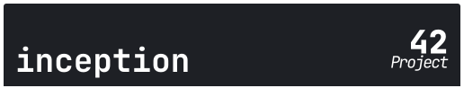

<h1 align="center">
	
 </h1>

 

 

### 🗣️ About

> _This project aims to broaden your knowledge of system administration by using Docker.
You will virtualize several Docker images, creating them in your new personal virtual
machine._

---

### Index

- [Definitions](#definitions)
- [References 📌](#references)
- [Skills 📄](#skills)
- [Author Info ✒️](#author)

## Definitions

####  What is a docker?

Docker is an open platform for developing, shipping, and running applications. Docker enables you to separate your applications from your infrastructure so you can deliver software quickly. With Docker, you can manage your infrastructure in the same ways you manage your applications. By taking advantage of Docker’s methodologies for shipping, testing, and deploying code quickly, you can significantly reduce the delay between writing code and running it in production. Docker provides the ability to package and run an application in a loosely isolated environment called a container.

#### What is a docker-compose?

Compose is a tool for defining and running multi-container Docker applications. With Compose, you use a YAML file to configure your application’s services. Then, with a single command, you create and start all the services from your configuration.

[Tutorial compose](https://www.educative.io/blog/docker-compose-tutorial)  
[Docker networking](https://www.aquasec.com/cloud-native-academy/docker-container/docker-networking/)

#### What is a docker-file?

Docker can build images automatically by reading the instructions from a Dockerfile. A Dockerfile is a text document that contains all the commands a user could call on the command line to assemble an image. Using docker build users can create an automated build that executes several command-line instructions in succession.

## References

- [Docker Crash Course for Absolute Beginners](https://www.youtube.com/watch?v=pg19Z8LL06w)
- [Notion 42](https://www.notion.so/lalex-ku/Inception-d74c98cb5fcb4aaf91c19dac01a7310e)
- [Never install locally](https://www.youtube.com/watch?v=J0NuOlA2xDc&t=340s)
- [WP-CLI](https://king.host/wiki/artigo/instalar-wordpress-wpcli/)
- [PHP-FPM](https://www.node35.com/how-to-install-multiphp-fpm-php-7-4-php-8-0-php-8-1-on-debian-11-bullseye/)
- [Configuring MariaDB with Option Files](https://mariadb.com/kb/en/configuring-mariadb-with-option-files/#option-prefixes)
- [wp-config.php](https://codex.wordpress.org/pt-br:Editando_wp-config.php)
- [DESCOMPLICANDO O DOCKER](https://www.youtube.com/watch?v=Wm99C_f7Kxw&list=PLf-O3X2-mxDn1VpyU2q3fuI6YYeIWp5rR)

## Skills

- Rigor
- Network & system administration

## Author

| [ Jessica Fernanda](https://github.com/nandajfa) |
| :--------------------------------------------------------------------------------------------------------------------------------------: |

[>)](https://www.linkedin.com/in/jessica-fernanda-programadora/)

  <b><a href="#index">↥ back to top</a></b>

 
